# User Flow Diagram - Web3 Milestone Crowdfunding Platform

## 📋 Overview

This document provides comprehensive user flow diagrams for the two main user types:
1. **Investor (Funder)** - Browses, funds, and votes on projects
2. **Project Initiator (Founder)** - Creates campaigns and submits milestones

---

## 🎯 User Types

### Investor (Funder)
- **Goal**: Support projects and ensure milestone completion
- **Actions**: Browse, fund, vote, claim refunds
- **Risk Profiles**: Conservative (50/50), Balanced (70/30), Aggressive (90/10)

### Project Initiator (Founder)
- **Goal**: Raise funds and deliver project milestones
- **Actions**: Create campaign, develop project, submit milestones, receive funds

---

## 📊 Complete System Flow Diagram

```mermaid
graph TD
    Start([Platform Entry]) --> UserType{User Type?}
    
    %% ===== INVESTOR FLOW =====
    UserType -->|Investor| I1[Connect Wallet]
    I1 --> I2[Browse Projects]
    I2 --> I3{Find Interesting<br/>Project?}
    I3 -->|No| I2
    I3 -->|Yes| I4[View Campaign Details]
    
    I4 --> I5[Review:<br/>- Title & Description<br/>- Funding Goal & Progress<br/>- 5 Milestones<br/>- Founder Info<br/>- Current State]
    
    I5 --> I6{Fund<br/>This Project?}
    I6 -->|No| I2
    I6 -->|Yes| I7[Choose Risk Profile]
    
    I7 --> I8{Risk Profile}
    I8 -->|Conservative| I9[50% Committed<br/>50% Reserve]
    I8 -->|Balanced| I10[70% Committed<br/>30% Reserve]
    I8 -->|Aggressive| I11[90% Committed<br/>10% Reserve]
    
    I9 --> I12[Enter Amount<br/>Min: 0.001 ETH]
    I10 --> I12
    I11 --> I12
    
    I12 --> I13[Confirm Transaction]
    I13 --> I14[Funding Successful!]
    
    I14 --> I15[Wait for Founder<br/>to Submit Milestone]
    
    %% Milestone Voting Loop
    I15 --> I16[Milestone Submitted<br/>Voting Opens 7 Days]
    
    I16 --> I17[Review Milestone Evidence<br/>IPFS Link]
    
    I17 --> I18{Vote on<br/>Milestone Achievement}
    
    I18 -->|Vote YES| I19[Cast YES Vote<br/>Weighted by Contribution]
    I18 -->|Vote NO| I20[Cast NO Vote<br/>Weighted by Contribution]
    I18 -->|Don't Vote| I21[Miss Vote]
    
    I21 --> I22{Consecutive<br/>Missed Votes}
    I22 -->|< 2 misses| I23[Missed Votes: +1]
    I22 -->|>= 2 misses| I24[Auto-YES Mode<br/>All Future Votes = YES]
    
    I19 --> I25[Voting Period Ends<br/>7 Days]
    I20 --> I25
    I23 --> I25
    I24 --> I25
    
    I25 --> I26{Vote Result<br/>>60% YES?}
    
    I26 -->|YES| I27[✅ Milestone Approved<br/>Funds Released to Founder]
    I26 -->|NO| I28[❌ Milestone Rejected]
    
    I28 --> I29{Rejection Count}
    I29 -->|1st Rejection| I30[Founder Can Resubmit]
    I29 -->|2nd Rejection| I31[❌ Campaign Failed]
    
    I30 --> I15
    
    I27 --> I32{All 5 Milestones<br/>Completed?}
    I32 -->|No| I33[Move to Next Milestone<br/>M1→M2→M3→M4→M5]
    I32 -->|Yes| I34[✅ Campaign Completed<br/>All Reserves Released]
    
    I33 --> I15
    
    I34 --> I35[🎉 Investment Complete<br/>Project Delivered]
    
    I31 --> I36[Refund Available]
    I36 --> I37[Calculate Refund:<br/>- Unreleased Committed<br/>- Full Reserve<br/>- Minus 2% Fee]
    I37 --> I38[Claim Refund]
    I38 --> I39[Receive Refund to Wallet]
    
    I39 --> End1([End: Investor Flow])
    I35 --> End1
    
    %% ===== PROJECT INITIATOR FLOW =====
    UserType -->|Project Initiator| P1[Connect Wallet]
    P1 --> P2[Create New Campaign]
    
    P2 --> P3[Fill Campaign Details]
    P3 --> P4[Enter:<br/>- Title 3-100 chars<br/>- Description 1-1000 chars<br/>- Funding Goal 0.01-10000 ETH]
    
    P4 --> P5[Define 5 Milestones]
    P5 --> P6[For Each Milestone:<br/>- Description<br/>- Deadline 7-365 days<br/>- Release % 5-50% each<br/>Total Must = 100%]
    
    P6 --> P7[Example Milestones:<br/>M0: Prototype 10% 30d<br/>M1: MVP 20% 90d<br/>M2: Beta 25% 150d<br/>M3: Launch 25% 240d<br/>M4: Growth 20% 330d]
    
    P7 --> P8[Pay Creation Fee]
    P8 --> P9[Confirm Transaction]
    P9 --> P10[✅ Campaign Created!<br/>State: Active]
    
    P10 --> P11[Share Campaign Link<br/>Wait for Funders]
    
    P11 --> P12{Funding Goal<br/>Reached?}
    P12 -->|No| P13[Promote Campaign<br/>Attract Funders]
    P13 --> P12
    
    P12 -->|Yes| P14[🎉 Fully Funded!<br/>Start Development]
    
    %% Development & Milestone Submission Loop
    P14 --> P15[Work on Current Milestone]
    P15 --> P16[Develop & Build]
    
    P16 --> P17{Milestone<br/>Achieved?}
    P17 -->|Not Yet| P16
    
    P17 -->|Yes| P18[Prepare Evidence:<br/>- Screenshots<br/>- Documentation<br/>- Demo Links<br/>- Code Repos]
    
    P18 --> P19[Upload Evidence to IPFS]
    P19 --> P20[Get IPFS Hash]
    
    P20 --> P21{Before<br/>Deadline?}
    P21 -->|No| P22[⚠️ Deadline Exceeded<br/>Campaign Failed]
    P21 -->|Yes| P23[Submit Milestone<br/>with IPFS Hash]
    
    P23 --> P24[Voting Period Starts<br/>7 Days]
    
    P24 --> P25[Wait for Investors<br/>to Vote]
    
    P25 --> P26[Voting Period Ends]
    P26 --> P27{Vote Result<br/>>60% YES?}
    
    P27 -->|YES| P28[✅ Milestone Approved!]
    P27 -->|NO| P29[❌ Milestone Rejected]
    
    P28 --> P30[Receive Funds:<br/>X% of Committed Pool]
    
    P30 --> P31[Funds Transferred<br/>to Wallet]
    
    P31 --> P32{All 5 Milestones<br/>Completed?}
    P32 -->|No| P33[Move to Next Milestone<br/>M0→M1→M2→M3→M4]
    P32 -->|Yes| P34[🎉 Final Milestone!<br/>Receive All Reserves]
    
    P33 --> P15
    
    P34 --> P35[✅ Campaign Completed<br/>Project Delivered]
    P35 --> P36[Received 100% of<br/>Raised Funds]
    
    P29 --> P37{Rejection Count}
    P37 -->|1st Rejection| P38[Review Feedback]
    P38 --> P39[Improve Deliverable]
    P39 --> P18
    
    P37 -->|2nd Rejection| P40[❌ Campaign Failed<br/>No More Funds]
    
    P22 --> End2([End: Project Failed])
    P40 --> End2
    P36 --> End3([End: Project Success])
    
    %% ===== CAMPAIGN STATE FLOW =====
    style Start fill:#e1f5ff
    style I14 fill:#d4edda
    style I27 fill:#d4edda
    style I34 fill:#d4edda
    style I35 fill:#90EE90
    style I31 fill:#f8d7da
    style I39 fill:#fff3cd
    
    style P10 fill:#d4edda
    style P14 fill:#d4edda
    style P28 fill:#d4edda
    style P31 fill:#90EE90
    style P35 fill:#90EE90
    style P22 fill:#f8d7da
    style P40 fill:#f8d7da
    
    style End1 fill:#e1f5ff
    style End2 fill:#f8d7da
    style End3 fill:#90EE90
```



---

## 🔄 Simplified Flow Diagram

### Investor Journey
```
┌─────────────────────────────────────────────────────────────────┐
│                     INVESTOR FLOW                                │
└─────────────────────────────────────────────────────────────────┘

1. BROWSE PROJECTS
   ├─→ View all active campaigns
   ├─→ Filter by category/goal
   └─→ Search by name

2. SELECT PROJECT
   ├─→ Read title & description
   ├─→ Check funding progress
   ├─→ Review 5 milestones
   ├─→ Verify founder info
   └─→ Assess current state

3. FUND PROJECT
   ├─→ Choose Risk Profile:
   │   ├─→ Conservative (50/50)
   │   ├─→ Balanced (70/30)
   │   └─→ Aggressive (90/10)
   ├─→ Enter amount (min 0.001 ETH)
   ├─→ Confirm transaction
   └─→ Receive confirmation

4. VOTE ON MILESTONES (Repeat 5x)
   ├─→ Receive notification of submission
   ├─→ Review IPFS evidence
   ├─→ Vote within 7 days:
   │   ├─→ YES (approve milestone)
   │   ├─→ NO (reject milestone)
   │   └─→ Skip (auto-YES after 2 misses)
   └─→ Wait for result

5. MILESTONE RESULT
   ├─→ APPROVED (>60% YES)
   │   ├─→ Funds released to founder
   │   └─→ Move to next milestone
   │
   └─→ REJECTED (<60% YES)
       ├─→ 1st rejection: Founder resubmits
       └─→ 2nd rejection: Campaign fails → Refund

6. CAMPAIGN COMPLETION
   ├─→ SUCCESS: All 5 milestones approved
   │   └─→ Investment complete
   │
   └─→ FAILURE: Deadline or 2 rejections
       └─→ Claim refund
           ├─→ Unreleased committed funds
           ├─→ Full reserve funds
           └─→ Minus 2% platform fee
```

### Project Initiator Journey
```
┌─────────────────────────────────────────────────────────────────┐
│                   PROJECT INITIATOR FLOW                         │
└─────────────────────────────────────────────────────────────────┘

1. CREATE CAMPAIGN
   ├─→ Connect wallet
   ├─→ Enter campaign details:
   │   ├─→ Title (3-100 chars)
   │   ├─→ Description (1-1000 chars)
   │   └─→ Funding goal (0.01-10000 ETH)
   │
   ├─→ Define 5 milestones:
   │   ├─→ Descriptions
   │   ├─→ Deadlines (7-365 days, chronological)
   │   └─→ Release % (5-50% each, total=100%)
   │
   ├─→ Pay creation fee
   └─→ Campaign goes live!

2. ATTRACT FUNDERS
   ├─→ Share campaign link
   ├─→ Promote on social media
   ├─→ Engage with community
   └─→ Wait for funding goal

3. DEVELOP PROJECT
   ├─→ Start working on Milestone 0
   ├─→ Build features/deliverables
   ├─→ Document progress
   └─→ Prepare evidence

4. SUBMIT MILESTONE (Repeat 5x)
   ├─→ Complete milestone work
   ├─→ Prepare evidence:
   │   ├─→ Screenshots
   │   ├─→ Documentation
   │   ├─→ Demo links
   │   └─→ Code repositories
   │
   ├─→ Upload to IPFS
   ├─→ Submit with IPFS hash
   └─→ Must be before deadline!

5. VOTING PERIOD
   ├─→ 7-day voting window
   ├─→ Investors review evidence
   ├─→ Votes cast (weighted)
   └─→ Wait for finalization

6. MILESTONE RESULT
   ├─→ APPROVED (>60% YES)
   │   ├─→ Receive X% of committed pool
   │   ├─→ Funds sent to wallet
   │   └─→ Move to next milestone
   │
   └─→ REJECTED (<60% YES)
       ├─→ 1st rejection: Improve & resubmit
       └─→ 2nd rejection: Campaign fails

7. CAMPAIGN COMPLETION
   ├─→ SUCCESS: All 5 milestones approved
   │   ├─→ Receive 100% of raised funds
   │   └─→ Project delivered!
   │
   └─→ FAILURE: Deadline or 2 rejections
       └─→ No more funds
```

---

## 📈 Project Lifecycle States

```
┌─────────────────────────────────────────────────────────────────┐
│                    PROJECT STATE DIAGRAM                         │
└─────────────────────────────────────────────────────────────────┘

Campaign Created
      │
      ├─→ State: Active
      │   ├─→ Open for funding
      │   └─→ Goal: Reach funding target
      │
      ↓
Funding Phase
      │
      ├─→ Funders contribute with risk profiles
      ├─→ Funds split: Committed vs Reserve
      └─→ Track progress to goal
      │
      ↓
Development Phase (Milestone 0)
      │
      ├─→ Founder develops
      ├─→ Founder submits evidence
      ├─→ State: Milestone Voting
      │
      ↓
Voting Period (7 days)
      │
      ├─→ Funders review evidence
      ├─→ Funders cast votes (YES/NO)
      └─→ Whale protection applied (20% max)
      │
      ↓
Vote Finalization
      │
      ├─→ Calculate: YES / (YES + NO)
      │
      ├─→ APPROVED (>60%)
      │   ├─→ Release X% of committed pool
      │   ├─→ Milestone: Completed
      │   └─→ If M4: Release all reserves
      │       └─→ Campaign: Completed ✅
      │
      └─→ REJECTED (<60%)
          ├─→ Rejection count +1
          │
          ├─→ 1st Rejection
          │   ├─→ Milestone: Pending (resubmit)
          │   └─→ Return to Development Phase
          │
          └─→ 2nd Rejection
              └─→ Campaign: Failed ❌
                  └─→ Refunds available

If NOT final milestone (M0-M3):
      │
      └─→ Move to next milestone
          └─→ Return to Development Phase

Additional Failure Conditions:
      │
      ├─→ Deadline Exceeded
      │   └─→ Campaign: Failed ❌
      │
      └─→ Founder Pauses
          └─→ Campaign: Paused
              └─→ Can unpause to resume
```

---

## 💰 Fund Flow Diagram

```
┌─────────────────────────────────────────────────────────────────┐
│                    FUND FLOW DIAGRAM                             │
└─────────────────────────────────────────────────────────────────┘

FUNDING PHASE
─────────────
Investor contributes 10 ETH with "Balanced" profile

    10 ETH
      │
      ├─→ Committed Pool: 7 ETH (70%)
      │   │
      │   ├─→ Available for milestone releases
      │   └─→ Released incrementally
      │
      └─→ Reserve Pool: 3 ETH (30%)
          │
          └─→ Released only after final milestone


MILESTONE RELEASES (from Committed Pool)
─────────────────────────────────────────
Campaign Setup:
- M0: Prototype    (10% of committed)
- M1: MVP          (20% of committed)
- M2: Beta         (25% of committed)
- M3: Launch       (25% of committed)
- M4: Growth       (20% of committed)

Fund Distribution:
    Committed: 7 ETH
      │
      ├─→ M0 Approved → Release 0.7 ETH  (10% of 7)
      │                 Remaining: 6.3 ETH
      │
      ├─→ M1 Approved → Release 1.4 ETH  (20% of 7)
      │                 Remaining: 4.9 ETH
      │
      ├─→ M2 Approved → Release 1.75 ETH (25% of 7)
      │                 Remaining: 3.15 ETH
      │
      ├─→ M3 Approved → Release 1.75 ETH (25% of 7)
      │                 Remaining: 1.4 ETH
      │
      └─→ M4 Approved → Release 1.4 ETH  (20% of 7)
                        Remaining: 0 ETH

    Reserve: 3 ETH
      │
      └─→ M4 Approved → Release 3 ETH (100%)
                        Campaign Complete!

Total Founder Receives: 10 ETH ✅


REFUND SCENARIO (Campaign fails at M2)
────────────────────────────────────────
Investor: 10 ETH (Balanced 70/30)

    Committed: 7 ETH
      │
      ├─→ M0 Released: 0.7 ETH  ❌ (Lost to founder)
      ├─→ M1 Released: 1.4 ETH  ❌ (Lost to founder)
      └─→ Unreleased: 4.9 ETH   ✅ (Refundable)

    Reserve: 3 ETH
      │
      └─→ Never Released: 3 ETH ✅ (Fully refundable)

Refund Calculation:
    ├─→ Unreleased committed: 4.9 ETH
    ├─→ Full reserve:        3.0 ETH
    ├─→ Subtotal:           7.9 ETH
    ├─→ Platform fee (2%):  -0.158 ETH
    └─→ Final Refund:       7.742 ETH

Investor Receives: 7.742 ETH
Investor Lost: 2.258 ETH (released milestones + fee)
```

---

## 🗳️ Voting Mechanism

```
┌─────────────────────────────────────────────────────────────────┐
│                    VOTING FLOW DIAGRAM                           │
└─────────────────────────────────────────────────────────────────┘

VOTING POWER CALCULATION
─────────────────────────
Base Power = Investor's Total Contribution

Anti-Whale Protection:
├─→ Max Power = 20% of total raised
└─→ If Base Power > Max Power:
    └─→ Voting Power = Max Power

Example:
    Total Raised: 100 ETH
    Max Power: 20 ETH (20%)
    
    Investor A: 50 ETH → Power capped at 20 ETH
    Investor B: 15 ETH → Power = 15 ETH (no cap)
    Investor C: 10 ETH → Power = 10 ETH (no cap)


VOTING PROCESS
───────────────
1. Milestone Submitted
   └─→ Voting period: 7 days

2. Investors Review Evidence
   └─→ Access IPFS link

3. Cast Vote
   ├─→ YES (approve)
   ├─→ NO (reject)
   └─→ SKIP (don't vote)

4. Track Participation
   ├─→ Voted → Reset missed count to 0
   └─→ Skipped → Increment missed count
       └─→ If missed >= 2:
           └─→ Auto-YES mode activated
               └─→ All future votes = YES

5. Voting Period Ends
   └─→ Finalize results


VOTE FINALIZATION
──────────────────
Process Non-Voters:
├─→ For each non-voter:
│   ├─→ Missed votes +1
│   └─→ If missed >= 2:
│       └─→ Auto-cast YES vote

Calculate Result:
├─→ Total YES votes (with voting power)
├─→ Total NO votes (with voting power)
└─→ Approval % = YES / (YES + NO)

Decision:
├─→ If Approval >= 60%:
│   └─→ Milestone APPROVED ✅
│       └─→ Release funds to founder
│
└─→ If Approval < 60%:
    └─→ Milestone REJECTED ❌
        ├─→ 1st rejection: Allow resubmission
        └─→ 2nd rejection: Fail campaign


VOTING SCENARIOS
─────────────────
Scenario 1: Strong Approval
├─→ Total Raised: 100 ETH
├─→ YES votes: 75 ETH (75%)
├─→ NO votes: 25 ETH (25%)
└─→ Result: APPROVED ✅

Scenario 2: Borderline Approval
├─→ Total Raised: 100 ETH
├─→ YES votes: 60 ETH (60%)
├─→ NO votes: 40 ETH (40%)
└─→ Result: APPROVED ✅

Scenario 3: Rejection
├─→ Total Raised: 100 ETH
├─→ YES votes: 45 ETH (45%)
├─→ NO votes: 55 ETH (55%)
└─→ Result: REJECTED ❌

Scenario 4: Low Participation + Auto-YES
├─→ Total Raised: 100 ETH
├─→ Manual votes: 30 ETH
│   ├─→ YES: 20 ETH
│   └─→ NO: 10 ETH
├─→ Auto-YES (non-voters): 50 ETH
└─→ Final: YES 70 ETH (70%), NO 10 ETH (10%)
    └─→ Result: APPROVED ✅
```

---

## 🚨 Risk Profile Impact

```
┌─────────────────────────────────────────────────────────────────┐
│                 RISK PROFILE COMPARISON                          │
└─────────────────────────────────────────────────────────────────┘

Investment: 10 ETH
Campaign: Fails at Milestone 2 (after M0 and M1 approved)

───────────────────────────────────────────────────────────────────
CONSERVATIVE (50/50)
───────────────────────────────────────────────────────────────────
├─→ Committed: 5 ETH
│   ├─→ M0 (10%): 0.5 ETH released ❌
│   ├─→ M1 (20%): 1.0 ETH released ❌
│   └─→ Unreleased: 3.5 ETH ✅
│
└─→ Reserve: 5 ETH ✅

Refund:
├─→ Unreleased committed: 3.5 ETH
├─→ Full reserve: 5 ETH
├─→ Subtotal: 8.5 ETH
├─→ Platform fee (2%): -0.17 ETH
└─→ Final refund: 8.33 ETH

Lost: 1.67 ETH (16.7%)

───────────────────────────────────────────────────────────────────
BALANCED (70/30)
───────────────────────────────────────────────────────────────────
├─→ Committed: 7 ETH
│   ├─→ M0 (10%): 0.7 ETH released ❌
│   ├─→ M1 (20%): 1.4 ETH released ❌
│   └─→ Unreleased: 4.9 ETH ✅
│
└─→ Reserve: 3 ETH ✅

Refund:
├─→ Unreleased committed: 4.9 ETH
├─→ Full reserve: 3 ETH
├─→ Subtotal: 7.9 ETH
├─→ Platform fee (2%): -0.158 ETH
└─→ Final refund: 7.742 ETH

Lost: 2.258 ETH (22.58%)

───────────────────────────────────────────────────────────────────
AGGRESSIVE (90/10)
───────────────────────────────────────────────────────────────────
├─→ Committed: 9 ETH
│   ├─→ M0 (10%): 0.9 ETH released ❌
│   ├─→ M1 (20%): 1.8 ETH released ❌
│   └─→ Unreleased: 6.3 ETH ✅
│
└─→ Reserve: 1 ETH ✅

Refund:
├─→ Unreleased committed: 6.3 ETH
├─→ Full reserve: 1 ETH
├─→ Subtotal: 7.3 ETH
├─→ Platform fee (2%): -0.146 ETH
└─→ Final refund: 7.154 ETH

Lost: 2.846 ETH (28.46%)

───────────────────────────────────────────────────────────────────
SUMMARY
───────────────────────────────────────────────────────────────────
Conservative: Lose 16.7% if fails at M2 (lowest risk)
Balanced:     Lose 22.6% if fails at M2 (medium risk)
Aggressive:   Lose 28.5% if fails at M2 (highest risk)

The earlier the campaign fails, the better for investors!
The later it fails, more funds have been released.
```

---

## 🎯 Key Interactions Summary

### Investor → Campaign
1. **Fund**: Contribute ETH with risk profile choice
2. **Vote**: Approve/reject milestones (7-day window)
3. **Claim Refund**: Recover funds if campaign fails

### Founder → Campaign
1. **Create**: Set up campaign with 5 milestones
2. **Submit Milestone**: Upload evidence to IPFS and submit
3. **Receive Funds**: Get released funds after approval

### Campaign → Investors
1. **Notify**: Alert when milestone submitted
2. **Request Vote**: Open 7-day voting window
3. **Release Refund**: Process refunds if failed

### Campaign → Founder
1. **Collect Fees**: Take creation fee upfront
2. **Release Funds**: Send approved milestone funds
3. **Release Reserves**: Send all reserves after M4

### Platform → All
1. **Track**: Monitor all campaigns and states
2. **Enforce Rules**: Apply voting thresholds and deadlines
3. **Collect Fees**: Take 2% platform fee on refunds

---

## 📱 User Interface Flow

### Investor Dashboard
```
┌─────────────────────────────────────────────────────────────────┐
│  🏠 Home                                                         │
├─────────────────────────────────────────────────────────────────┤
│                                                                  │
│  🔍 Browse Projects                                              │
│  ┌──────────────┬──────────────┬──────────────┐               │
│  │ Project A    │ Project B    │ Project C    │               │
│  │ 80% funded   │ 45% funded   │ 100% funded  │               │
│  │ M2 Voting    │ M0 Pending   │ M4 Completed │               │
│  └──────────────┴──────────────┴──────────────┘               │
│                                                                  │
│  📊 My Investments (3)                                           │
│  ┌──────────────────────────────────────────────────────────┐  │
│  │ Project A - 1.5 ETH - Balanced                            │  │
│  │ Status: Voting on M2 [Vote Now →]                        │  │
│  ├──────────────────────────────────────────────────────────┤  │
│  │ Project D - 2.0 ETH - Aggressive                          │  │
│  │ Status: M1 Approved ✅                                     │  │
│  ├──────────────────────────────────────────────────────────┤  │
│  │ Project E - 0.5 ETH - Conservative                        │  │
│  │ Status: Campaign Failed [Claim Refund →]                 │  │
│  └──────────────────────────────────────────────────────────┘  │
│                                                                  │
│  🔔 Notifications (2)                                            │
│  • Project A: Milestone 2 submitted - Vote now!               │
│  • Project E: Refund available - Claim 0.42 ETH               │
│                                                                  │
└─────────────────────────────────────────────────────────────────┘
```

### Founder Dashboard
```
┌─────────────────────────────────────────────────────────────────┐
│  🏠 Home                                                         │
├─────────────────────────────────────────────────────────────────┤
│                                                                  │
│  ➕ [Create New Campaign]                                        │
│                                                                  │
│  📊 My Campaigns (2)                                             │
│  ┌──────────────────────────────────────────────────────────┐  │
│  │ My DeFi Project                                           │  │
│  │ ├─→ Goal: 50 ETH | Raised: 50 ETH (100%)                 │  │
│  │ ├─→ Current: Milestone 2                                 │  │
│  │ ├─→ Status: Voting (3 days left)                         │  │
│  │ ├─→ Votes: 35 ETH YES (70%), 15 ETH NO (30%)            │  │
│  │ └─→ [View Details] [Finalize Early]                      │  │
│  ├──────────────────────────────────────────────────────────┤  │
│  │ NFT Marketplace                                           │  │
│  │ ├─→ Goal: 20 ETH | Raised: 14 ETH (70%)                  │  │
│  │ ├─→ Current: Milestone 0                                 │  │
│  │ ├─→ Status: Active - Awaiting submission                 │  │
│  │ ├─→ Deadline: 12 days                                    │  │
│  │ └─→ [Submit Milestone] [Pause Campaign]                  │  │
│  └──────────────────────────────────────────────────────────┘  │
│                                                                  │
│  💰 Total Raised: 64 ETH                                         │
│  💰 Total Received: 15.5 ETH (from approved milestones)         │
│                                                                  │
│  🔔 Notifications (1)                                            │
│  • My DeFi Project: Milestone 2 likely to pass - Check votes  │
│                                                                  │
└─────────────────────────────────────────────────────────────────┘
```

---

## 📝 Notes

### Important Rules
1. **Risk profile locked**: Cannot change after first contribution
2. **5 milestones required**: Must sum to exactly 100%
3. **Sequential milestones**: Must complete in order (M0→M1→M2→M3→M4)
4. **Voting deadline**: Automatically finalized after 7 days
5. **Anti-whale protection**: Max 20% voting power per investor
6. **Mandatory voting**: 2 consecutive misses = auto-YES mode
7. **Two strikes rule**: 2 rejections = campaign fails
8. **Deadline enforcement**: Miss deadline = campaign fails
9. **Reserve release**: Only after final milestone (M4) approved
10. **Refund fee**: 2% platform fee deducted from refunds

### Best Practices

**For Investors:**
- Research projects thoroughly before funding
- Choose risk profile carefully (can't change)
- Vote on all milestones to maintain control
- Check IPFS evidence before voting
- Conservative profile recommended for first-time investors

**For Founders:**
- Set realistic milestones and deadlines
- Provide clear, detailed evidence for each milestone
- Communicate with funders regularly
- Build community trust before launch
- Submit milestones well before deadlines

---

**Created:** Based on documentation analysis
**Last Updated:** {{ current_date }}
**Version:** 1.0


